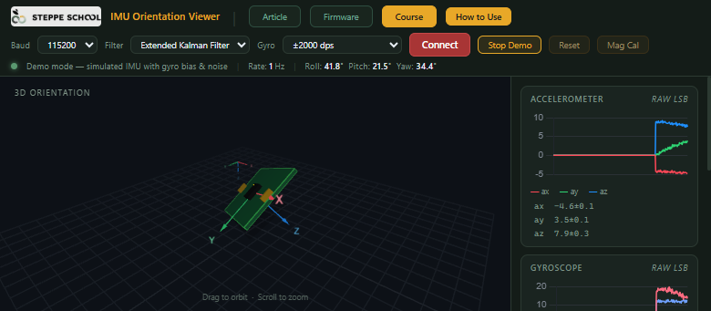

# hello_imu

STM32H723VGT6（达妙 DM-MC-Board02 / CtrBoard-H7）上的 BMI088 读数固件：100 Hz 读
陀螺仪/加速度，通过 UART7 以二进制包打出，并用板载 WS2812 指示状态。

## 上位机：网页版（无需装任何软件）



> 上图是网页自带 **Demo Mode**（模拟数据）的截图，只为展示界面长什么样；
> 接上单板后 3D 模型和 Roll / Pitch 会跟着板子一起动。

直接用 Chrome / Edge（需要 Web Serial API）打开 <https://imu.steppeschool.com/>，
接线后按下表设置，点 `Connect` 选串口即可：

| 控件 | 选什么 | 说明 |
| --- | --- | --- |
| Baud | **115200** | 必须和固件里的 UART7 波特率一致（固件只用到网站支持的这几档） |
| Filter | 随便 | 只是网页上的姿态解算方式，不影响串口数据 |
| Gyro | **±2000 dps** | 固件里陀螺仪量程是 `BMI088_GYRO_RANGE_2000`，选错转动速度会不对 |

- 加速度量程不用在网页上设置：网页只拿加速度算姿态方向，比例不影响结果。
- 本板没有磁力计，包里的磁力 3 轴固定填 0，所以 yaw 没有绝对方位参考，会漂（网页上
  `Mag Cal` 也用不上）。
- 网页会对 `ax / gy / gz` 取反（这是参考板的贴装方向）。本板 BMI088 的贴装和参考板不同，
  固件里做了一套轴向映射：**X = -传感器 Y、Y = 传感器 X、Z 不变**（加速度和陀螺同一套）。
  如果 3D 模型的转动方向还是相反/镜像，继续改 `Core/Src/main.c` 里打包那 6 个分量的
  符号/顺序即可。

- 红灯常亮 = BMI088 还没初始化成功（会一直重试，错误码打串口）
- 绿灯常亮 = 初始化成功，开始输出数据

## 构建

工具链不在默认 `PATH` 里，需要先指向 STM32Cube 的 bundle：

```bash
export PATH="/home/taishan/.local/share/stm32cube/bundles/gnu-tools-for-stm32/14.3.1+st.2/bin:/home/taishan/.local/share/stm32cube/bundles/ninja/1.13.2+st.1/bin:$PATH"

cube-cmake --preset Debug && ninja -C build/Debug      # Release 换成 --preset Release / build/Release
```

## CubeMX 重新生成代码后要检查什么（★ 容易忘）

1. `cmake/stm32cubemx/CMakeLists.txt` **每次** “Generate Code” 都会被重写；
   根 `CMakeLists.txt` 只在**第一次**生成，之后的用户改动不会被覆盖。
2. 自己新增的驱动**不要**直接写进生成文件，统一走「独立 cmake 片段」模式：
   - 配置放在 `cmake/bmi088.cmake`、`cmake/ws2812.cmake`（CubeMX 不认这些文件，永远不会被覆盖）
   - 由根 `CMakeLists.txt` 里的两行 `include(cmake/xxx.cmake)` 拉进来（当前在 `CMakeLists.txt:66-67`）
3. 所以 regenerate 之后如果发现某个驱动没编进固件，**先看那两行 `include()` 还在不在**，
   不要急着改 `cmake/stm32cubemx/CMakeLists.txt`（改了下次还会丢）。

> 教训（2026-09-16）：BMI088 的源文件一开始是直接加在生成文件里的，一次 “Generate Code”
> 就被抹掉了，之后才改成现在的片段写法。

## 硬件要点（DM-MC-Board02）

| 功能 | 引脚 |
| --- | --- |
| 可控 5V 使能（`Power_5V_EN`，高有效） | **PC15** |
| BMI088 加速度片选 / 陀螺片选 | PC0 / PC3 |
| SPI2：SCK / MOSI / MISO | PB13 / PC1 / PC2_C |
| SPI2 中断：ACC_INT / GYRO_INT | PE10 / PE12 |
| UART7 | PE7 (RX) / PE8 (TX) |
| 板载 WS2812：DIN | **PA7 = SPI6_MOSI** |

- 5V 在 CubeMX 里上电默认是**关**的，`main()` 的 USER CODE 2 里才打开，等 100 ms
  让电源轨稳定后再和 BMI088 通信（BMI088 要求 VDD 有效后陀螺仪约 30 ms 才可访问）。
- WS2812 不走普通 GPIO，而是用 SPI6 的 MOSI 波形模拟单总线：**1 个 SPI 字节 = 1 个数据位**
  （`0` → `0x60`，`1` → `0x78`），一帧 24 字节（G-R-B），之后补 ≥50 µs 低电平锁存。
  SPI6 内核时钟取 HSE 24 MHz，预分频 4 → 6 MHz。

### ⚠️ SPI6 的 SCK 占用了 PA5（按键 / ADC1_CH18）

- SPI 主机（哪怕是“只发不收”）**必须输出 SCK**，所以 CubeMX 把 `PA5 → SPI6_SCK` 也配上了，
  SPI6_SCK 的另一个可选脚 PB3 已经是 `SPI1_SCK`。
- 板子上 **PA5 = `ADC1_CH18_KEY`**（按键 / ADC 采样脚）。
- 后果：只要 SPI6 还开着，PA5 就不能再当按键 / ADC18 输入用；而且每次刷新灯珠都会在这个脚上
  打出约 32 µs 的 6 MHz 时钟（按着键正好撞上这个窗口还可能干扰这一帧灯珠数据）。
- 以后要用 PA5 的按键/ADC 时，必须先把 WS2812 改成不占 SPI 外设的方案
  （例如 PA7 当普通 GPIO 位翻转时序），然后就可以在 CubeMX 里把 SPI6 关掉。

## 串口输出

- UART7，**115200** 8N1（UART7 内核时钟 = D2PCLK1 = 120 MHz → USARTDIV 1041.625，误差 ≈ -0.004%）。
- 波特率存在 `hello_imu.ioc` 里，regenerate 不会丢；要改波特率请在 CubeMX 里改，不要只改代码。
  可选的档位受网页限制：9600 / 57600 / 115200 / 230400 / 250000，改完记得网页上选同一个值。
- 100 Hz 发一个 **20 字节二进制包**（对应网页 `Binary packet format`，同步头前面允许有
  ASCII 文本，网页会自己丢掉）：

| 字节 | 内容 | 类型 |
| --- | --- | --- |
| 0–1 | `0xAA 0xFF` 同步头 | — |
| 2–3 / 4–5 / 6–7 | 加速度 X / Y / Z | int16，小端，原始 LSB |
| 8–9 / 10–11 / 12–13 | 陀螺仪 X / Y / Z | int16，小端，原始 LSB |
| 14–19 | 磁力 X / Y / Z | int16，小端，本板没有磁力计 → 固定 0 |

发的是传感器**原始 LSB**（`BMI088_read_raw()`），不是 rad/s / g；网页自己按选定的量程换算。
温度不在协议里，固件仍在读但不往外发。

用串口助手之类的工具直接看会是一堆乱码，这是正常的（二进制协议）。
