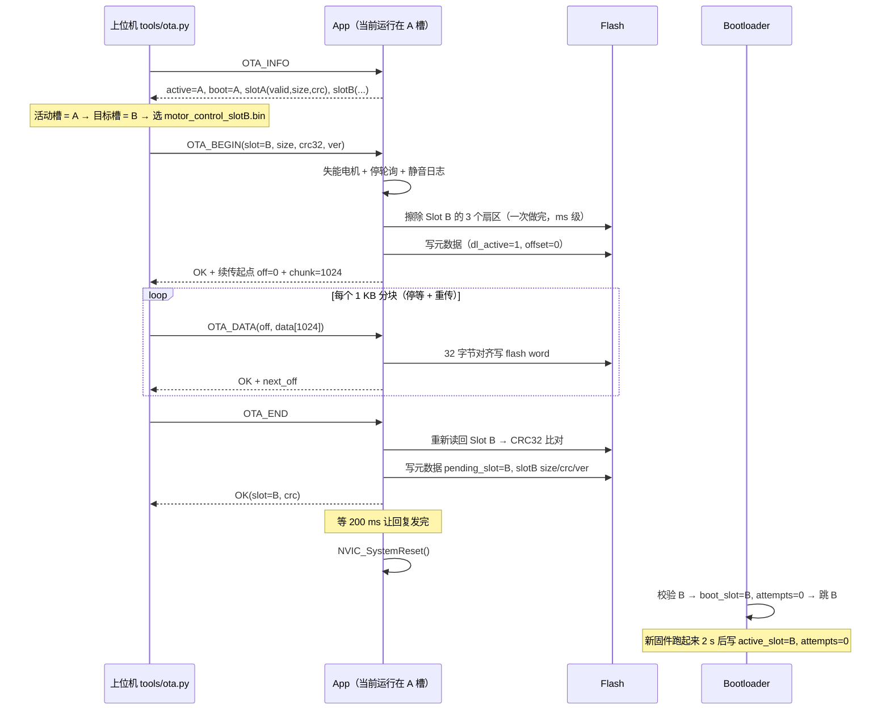

# 无线 OTA 升级方案（USART1 / PA9-PA10）

> 目标：**以后不用 ST-Link 也能升级固件**（包括升坏了的兜底恢复）；
> 平时不做 OTA 时，这一路串口照常当「调试日志 + 控制信息」用。

本文是设计说明（为什么这么分、每个坑怎么绕）；照着实现落地的代码在
`Device/Ota/`、`cmake/ota.cmake`、`STM32H723xG_slots.ld`、`tools/ota.py`，使用步骤见
README 的「无线 OTA」一节。

---

## 1. 现状与约束

| 项目 | 值 | 说明 |
| --- | --- | --- |
| MCU | STM32H723VGT6 | Cortex-M7 @ 550 MHz |
| Flash | **1024 KB，单 bank（bank swap 不可用）**，扇区 **8 × 128 KB** | H723 是 1 MB 单 bank 器件，没有 H743 那种「双 bank 硬件 swap」 |
| RAM | DTCM 128K + AXI 320K + D2 32K + D3 16K | 当前固件 `.data+.bss` 约 20 KB |
| 当前固件（Debug） | 加 OTA 之前约 **67 KB**；加了 OTA 模块之后 **87 KB**（`text 86740`，含 CRC/COBS/协议/服务共 ~7 KB） | 所以每个 App 槽给 384 KB，余量 4 倍以上 |
| 现有串口 | USART10(PE2/PE3,38400) 电机；UART7(PE7/PE8,115200) 调试日志 | 都是「一问一答」或纯输出 |
| **新的无线口** | **USART1：PA9 = TX、PA10 = RX**（模块侧 UART0），**921600** 8N1 | 全双工，日志 + 控制帧 + OTA 三合一 |
| 现有工具链/生成方式 | CubeMX + CMake 片段；`cmake/stm32cubemx/CMakeLists.txt`、`Core/Src/*`、`.ld` 都会被 Generate Code 覆盖 | 用户代码只能放 `Device/`、`cmake/*.cmake` |

**关键约束：**H7 单 bank 下「在 Flash 里跑的程序去擦写同一片 Flash」，CPU 取指会被总线 stall
（不是 HardFault，会一直等到擦写完成）。所以：

* 长时间的操作（**扇区擦除，ms 量级**）集中放在 `OTA_BEGIN` 阶段一次做完，此时还没有数据在传；
* 传输过程中每写一个 flash word（32 字节，**几十 µs 量级**）才 stall 一次，靠串口硬件
  **16 字节 RX FIFO** + 软件 2 KB 环形缓冲顶过去；
* **不在同一个槽里自己升级自己**（见下面的 A/B 双槽）。

> 具体擦除/编程时间以 STM32H723 数据手册 Flash 特性表为准；本方案对这两个数量级不敏感，
> 只要能保证「擦除在收数据之前做完」「编程停顿 ≪ FIFO 能顶住的时间」即可。

---

## 2. Flash 分区

```
0x08000000 ┌──────────────────────────────┐
           │ s0  128K  Bootloader (BL)    │  ← 永不 OTA 更新；上电必然先跑它
0x08020000 ├──────────────────────────────┤
           │ s1  128K                     │
           │ s2  128K   Slot A (384K)     │  ← App 编译产物之一（链接基址 A）
           │ s3  128K                     │
0x08080000 ├──────────────────────────────┤
           │ s4  128K                     │
           │ s5  128K   Slot B (384K)     │  ← App 编译产物之二（链接基址 B，同一份源码）
           │ s6  128K                     │
0x080E0000 ├──────────────────────────────┤
           │ s7  128K  元数据扇区          │  ← OTA 状态记录（双份 ping-pong）+ 将来的参数/标定区
0x08100000 └──────────────────────────────┘
```

* **Bootloader 占满 s0**：H7 最小擦除单位就是 128 KB 扇区，没法只要 32 KB。
  BL 编译出来 **Debug 下约 45 KB / 128 KB**（`--gc-sections` 之后只留 HAL 的 uart/flash/rcc/gpio
  和公共层），Release 更小；剩下的空间留着以后放「双备份 bootloader / 恢复日志」都行。
* **A/B 双槽各 384 KB**：App 现在只有 67 KB，Debug 全开也够；A 槽和 B 槽是**同一份源码按不同
  链接基址编出来的两个 .bin**（唯一区别就是 `--defsym APP_BASE`）。
  这样做的原因见 [§10.1](#101-为什么不做单槽暂存区搬运)。
* **元数据扇区**：擦除粒度 128 KB，所以记录用「**顺序追加**」而不是「原地改写」：
  每条记录 256 字节，一个扇区能写 **512 条**才需要擦一次；
  上电时从偏移 0 顺序扫，遇到第一条无效记录就停（最后一条有效记录 = 当前状态）。

### 2.1 元数据记录（256 字节，尾部 4 字节是自身 CRC32）

| 字段 | 类型 | 含义 |
| --- | --- | --- |
| `magic` | u32 | `'OTAM'` = 0x4F54414D，无效则整条作废 |
| `seq` | u32 | 递增序号，扫描时取**最后一条有效记录**（顺序追加，不需要比大小） |
| `active_slot` | u8 | 现在正在跑（最后一次被 App 确认）的槽：0=A、1=B |
| `boot_slot` | u8 | 下次 BL 要跳的槽 |
| `boot_attempts` | u8 | 已连续跳进 `boot_slot` 但**App 还没确认**的次数 → ≥ 3 就判坏、回滚 |
| `flags` | u8 | bit0 = 本次重启停在 BL（主机主动要求进恢复台）；bit1 = 保留 |
| `slot_size[2]` / `slot_crc[2]` / `slot_ver[2]` | u32×6 | 两个槽当前镜像的大小 / CRC32 / 版本号（BL 用来校验、上报） |
| `pending_slot` | u8 | 0xFF = 无；否则表示「有一个校验通过、等着切换的新镜像」 |
| `dl_slot` / `dl_active` | u8×2 | 下载会话：往哪个槽写、是否正在进行（用于断链/掉电续传） |
| `dl_size` / `dl_crc` / `dl_offset` | u32×3 | 下载会话：总长度 / 目标 CRC32 / 已写入字节数（32 字节对齐） |
| `crc` | u32 | 本记录前 252 字节的 CRC32（`0x00000000` 表示空槽） |

> 掉电语义：任何一次写入都是「追加一条完整记录 + 自身 CRC32」。
> 如果写到一半掉电 → 这条记录 CRC 不过 → 扫描到它就停，用**上一条**有效记录，状态自动回退到
> 上一次提交点。这就是不需要日志文件系统也能保证原子性的做法。

---

## 3. 上电启动流程（Bootloader）

```mermaid
flowchart TD
    R[复位 → 0x08000000 BL] --> M[读元数据扇区<br/>取最后一条有效记录]
    M --> K{上电时按住了<br/>USER_KEY(PA15)?}
    K -- 是 --> CONSOLE
    K -- 否 --> F{flags 要求停在 BL?}
    F -- 是 --> CONSOLE
    F -- 否 --> P{pending_slot 有效?}
    P -- 有 --> V{校验 pending 槽 CRC32}
    V -- 通过 --> SW[切换: boot_slot=pending, attempts=0,<br/>清 pending, 写记录] --> T
    V -- 不通过 --> DP[丢弃这次 pending, 写记录] --> T
    P -- 无 --> T{校验 boot_slot 镜像 CRC32}
    T -- 通过 --> A{attempts >= 3 ?}
    A -- 是 --> RB[判该槽启动失败:<br/>换另一个槽当 boot_slot] --> T2{另一个槽有效?}
    T2 -- 是 --> T
    T2 -- 否 --> CONSOLE
    A -- 否 --> J[attempts++ 写记录<br/>→ 设置 VTOR / MSP, 跳转]
    T -- 不通过 --> T2
    CONSOLE[恢复台: 在 USART1 上收固件<br/>支持 INFO/BEGIN/DATA/END,<br/>可写进任意一个槽] --> J2[收到完整镜像 → 校验 → 写记录 → 复位]
```

* **每次启动都校验一遍 `boot_slot` 的 CRC32**（≤ 384 KB 软件 CRC，550 MHz 下几 ms），
  这样 Flash 位翻转/半途写入都能被发现，而不是跳进去跑飞。
* **回滚机制**：BL 每次跳进 `boot_slot` 前 `boot_attempts++` 并把记录落盘；
  App 启动成功（跑够 2 s、且电机通信自检过）后写一条 `boot_attempts=0, active_slot=当前槽` 的记录。
  新固件如果是「能编译但一跑就崩」，BL 数到 3 次就自动换回旧槽 → **不需要拆机**。
* **恢复台**：两个槽都无效（或它是空的/CRC 全错，比如第一次烧完 BL 还没烧 App）时进 BL 自己的
  命令行：同一个串口、同一套帧协议（少一个 `CTRL_*`），可以指定写进 A 或 B。
  这是「最坏情况的兜底」：只要 BL 还在（BL 永不 OTA），板子就不可能变砖。
* **物理后路：上电时按住 USER_KEY（PA15）** → 强制停在恢复台，**不管两个槽看着多正常**。
  没有这条的话：BL 只能「向量表看着像 App 就跳」，App 一启动就卡死就再也回不到恢复台
  （实测踩过）→ 只能上台架。有了它，任何情况都能从无线口重灌固件。
  恢复台里 `OTA_INFO` 回复的 `flags` 会带上 `0x80`，上位机据此知道「现在可以往任意槽写」，
  `--slot auto` 也会自动选元数据里的 `active` 槽（就是那个跑不起来的）。
* **跳转序列**（顺序很重要，`ota_boot.c` 里实现）：

  ```
  打印 "jump slot X SP=... PC=..."（诊断 1/2：看镜像和槽对不对）
  → 关中断（__disable_irq）  ← **故意不关 USART1**：留着还能打后面那行诊断，
                               App 的 OtaCom_Init() 会把串口重配一遍
  → 清 NVIC 的使能/挂起位（ICER/ICPR）
  → 清 SCB->ICSR 的 PENDSTCLR / PENDSVCLR（SysTick/PendSV 的挂起位不在 NVIC 里！）
  → 停 SysTick（CTRL/LOAD/VAL 全清）
  → HAL_MPU_Disable()
  → 开中断，打印 "cleanup done -> calling App Reset_Handler"（诊断 2/2：
     能打出来就说明 BL 没卡在自己身上，问题在 App 里）
  → 再关中断，SCB->VTOR = 槽基址
  → __set_MSP(镜像向量表[0])   __set_CONTROL(0)
  → __DSB() __ISB() → __enable_irq()   ← 必须开！（复位后 PRIMASK=0 是 CPU 默认，BL 自己关过）
  → 跳到 镜像向量表[1]
  ```

  ❌ **不要调 `HAL_RCC_DeInit()`**（已踩）：它内部会调 `HAL_InitTick()`，而 Bootloader 里解析到的是
  HAL 的弱实现（SysTick 版）→ 它会把 **SysTick 重新打开**（`CLKSOURCE|TICKINT|ENABLE`）。
  而 App 里 `SysTick_Handler` 是 CMSIS-RTOS2 的（`cmsis_os2.c` → `xPortSysTickHandler`
  = FreeRTOS 调度节拍），调度器还没初始化就被它打断 → 读 `pxDelayedTaskList`(NULL) →
  HardFault / 跑飞。**现象：跳过去之后一片安静，连启动日志都没有，`ota.py info` 也没回复。**
  时钟也不用退：BL 配的就是 App 要的那套，App 的 `SystemClock_Config()` 自己会重新校验/切换
  （哪怕只剩 64 MHz HSI 它也能配起来）。
  同理，**SysTick 必须在所有可能打开它的调用之后关**，并且连挂起位一起清 ——
  否则 App 一开中断就立刻进一次 SysTick 中断，一样跑飞。

  ⚠ **App 侧还要再设一次 VTOR**：H7 复位时 Flash 被镜像到 `0x00000000`，而
  `system_stm32h7xx.c` 里 `SCB->VTOR` 那句被 `#if defined(USER_VECT_TAB_ADDRESS)` 包着，
  **默认不执行**，也就是 VTOR 一直是复位值 `0x00000000`。
  从 BL 跳过去时 `0x00000000` 指向的还是 BL 的向量表 → 所有中断都跑到 BL 的 handler 里去。
  所以 App 的 `main()` 开头第一件事就是 `SCB->VTOR = (uint32_t)&__app_base;`（在 `MPU_Config()` 之前）。

---

## 4. 升级流程（App 在线升级 = 正常路径）



* 升级期间**电机一定是不使能的**（`OTA_BEGIN` 里强制失能 + 停 200 ms 轮询 + 静音日志），
  免得刷 Flash 的时候电机还在转。
* **断链/掉电续传**：会话进度每 32 KB 落一次元数据。主机重连后重新发 `OTA_BEGIN`，
  设备发现「同一个槽 + 同样的 size/crc」→ **不重新擦除**，直接回 `off=已写入字节数`，
  主机从文件的这个偏移接着发。
* **校验是「读回 Flash 再算」**，不是「边收边算」：这样能顺带发现 Flash 写入失败。
* 升级失败（CRC 不过）→ 清 `pending`，**继续用旧固件跑**，主机重来即可，板子不受影响。

---

## 5. 通信协议（日志 + 控制 + OTA 复用一路串口）

### 5.1 物理层 / 复用规则

| 项目 | 值 |
| --- | --- |
| 口 | USART1：PA9=TX、PA10=RX，AF7，**921600** 8N1（`OTA_PORT_BAUD`；要和无线模块的串口波特率一致，
     不自动识别的模块得两边都改。⚠ BL 不参与 OTA，它那份还是旧的 115200，所以升级时 BL 的 banner 是乱码，
     进 BL 恢复台要 `--baud 115200`） |
| 方向 | 全双工；日志是设备→主机，控制/OTA 是双向 |
| 复用 | **文本日志照旧直接发**（ASCII + `\r\n`），二进制帧用 `0x00` 定界 + COBS 编码 |
| 为什么不冲突 | ASCII 文本里**永远不出现 `0x00`**，而 COBS 编码后的帧里也**永远不出现 `0x00`** → 主机看到 `0x00` 之间的一段就是「候选帧」，COBS 解出来再验 CRC32；CRC 不过就当成文本忽略。设备侧同理，只认 `0xAA 0x55` 开头的合法帧 |

### 5.2 帧格式（COBS 编码之前）

```
 0xAA 0x55 │ VER │ TYPE │ SEQ │ LEN(2,LE) │ PAYLOAD[LEN] │ CRC32(4,LE)
 └──────────┴─────┴──────┴─────┴───────────┴──────────────┴───────────┘
             └──────────── CRC32 覆盖 VER..PAYLOAD 全部 ───────────┘
```

* `VER` = 0x01；`SEQ` 由主机递增，设备在回复里原样带回（用来配对请求/回复）。
* `LEN` ≤ 1028（OTA_DATA 最大 1024 字节数据）；帧总长 = **11 + LEN** 字节
  （SYNC2 + VER1 + TYPE1 + SEQ1 + LEN2 + CRC32 4）。
* 上线：`0x00 | COBS(上面这串) | 0x00`。
* **CRC32 = CRC-32/ISO-HDLC**（多项式 0xEDB88320，反射，初值/终值取反，即 Python `zlib.crc32`、
  `binascii.crc32` 那一套）。自检值：`"123456789"` → `0xCBF43926`。
  （注意别和电机协议的 CRC-8/MAXIM 搞混，那是另一套。）

### 5.3 命令表（TYPE；回复 = 请求 TYPE | 0x80，载荷第 1 字节固定是 `status`）

下表里 `[0]` 都是 `status`，其余字段从 `[1]` 开始按顺序排。**逐字节的权威定义在
`Device/Ota/src/ota_host.c` 文件头的注释里**，`tools/ota.py` 按同一份布局解析。

| TYPE | 名称 | 方向 | 请求载荷（不含帧头） | 回复载荷（除 status 外） |
| --- | --- | --- | --- | --- |
| 0x01 | `OTA_INFO` | H→D | — | 38 字节：`active(1) boot(1) pending(1) attempts(1) flags(1)` + `槽A{size(4) crc(4) ver(4)}` + `槽B{...}` + `运行版本(4)` + `BL版本(4)` |
| 0x02 | `OTA_BEGIN` | H→D | `slot(1, 0xFF=自动) size(4) crc(4) ver(4) flags(1, b0=强制重下)` | `off(4) chunk(2)`（`off` = 续传起点） |
| 0x03 | `OTA_DATA` | H→D | `off(4) data[n]` | `next_off(4)`（status≠OK 时表示**要重发的偏移**） |
| 0x04 | `OTA_END` | H→D | — | `slot(1) crc(4) 已写入(4)`；OK 时设备会自动重启切槽 |
| 0x05 | `OTA_ABORT` | H→D | — | `已写入(4)`（下次可接着传） |
| 0x06 | `OTA_REBOOT` | H→D | `mode(1)`：0=正常重启（并清"停在 BL"），1=重启进 BL 恢复台 | — |
| 0x07 | `OTA_ERASE` | H→D | `slot(1)` | — |
| 0x08 | `OTA_ROLLBACK` | H→D | — | `boot_slot(1)`：切回另一个槽并重启 |
| 0x10 | `CTRL_CMD` | H→D | `cmd(1) arg(4)` `[motor(1)]` | `data(4)` `[data2(4)]`（见 §5.4） |
| 0x11 | `CTRL_STATUS` | H→D | `[motor(1)]` | `mileage(4) position(2) fault(1) mode(1)` `[pwr(1)]` `[vmv(2) cells(1) flags(1)]` — 末尾几项都是后加的，老上位机不读就行 |
| 0x20 | `LOG` | D→H | — | 可选：把日志也包成帧（默认**不发**，日志走裸文本更好读） |

`status` 码：`0=OK`、`1=坏帧`、`2=状态机不允许`（比如没 BEGIN 就 DATA）、
`3=偏移不对`（回复里带上期望偏移）、`4=擦除失败`、`5=写入失败`、`6=CRC 不匹配`、
`7=长度/参数非法`、`8=不允许`（比如想写正在运行的那个槽）。

> `slot=0xFF`（自动选槽）的含义分两种场景：**App 在线升级**时 = 另一个（非活动）槽；
> **BL 恢复台**里 = 元数据里的 `active_slot`（也就是那个跑不起来的槽，就是要覆盖它）。

### 5.4 控制命令（平时不打 OTA 时用）

`CTRL_CMD.cmd`（`arg` 就是参数）：

| cmd | 含义 | arg |
| --- | --- | --- |
| 0x00 | 失能所有电机（0xA0/0x09） | — |
| 0x01 | 使能（重试到应答） | — |
| 0x02 | 切位置环（0xA0/0x03） | — |
| 0x03 | 走位置 | 0..32767 |
| 0x04 | 走角度 | 0..359（°） |
| 0x05 | 急停（0x64 value=0） | — |
| 0x06 | 静音日志（OTA 前会自动开） | 0/1 |
| 0x07 | 暂停/恢复 200 ms 状态轮询 | 0/1 |
| 0x08 | 电机电源（PC14 可控电源输出，高电平使能） | 0=断电、1=上电（等稳定）、2=断电重启 |
| 0x09 | 读电源电压（PC4/ADC1_INP4 分压取样，**不是电机命令**） | — （`data`=总压 mV、`data2`=电池串数） |
| 0x0A | 设置电池串数（算“单片电压”用，**不是电机命令**） | 1..8（6=6S 电池、3=12V 那套） |

> **PC14 那路电源**：上电**默认关断**（`main()` 里 `MotorPwr_Init()` 就把它配成输出并拉低）。
> 按 USER_KEY 或发 `ctrl enable` 时会先上电并等 `MOTOR_PWR_SETTLE_MS`(500 ms) 再发使能帧；
> 发 `ctrl disable` / 进 OTA 模式会把它一并切掉。`ctrl pwr` 的回复 `data` 是当前状态（0/1）。
> 升级期间只允许 `arg=0`（断电）—— 正在擦写 Flash 时不该把电机重新上电。
> ⚠ PC14/PC15 是 OSC32 引脚（板载没焊 32.768 kHz 晶振才能这么用），属备份域、驱动能力很弱，
> **只能当使能信号**用，电流得电源那边出。

`CTRL_STATUS` 是只读快照（里程/位置/故障码/模式，末尾还多一个字节表示电机电源是否使能），
比 `0x74` 那套「一问一答 + 文本日志」更适合上位机做曲线。

> **`CTRL_CMD` 的回帧布局**（9 字节）：`status(1) data(4) data2(4)`。
> `data2` 是后加的（只为新命令服务，用不上时填 0），**尾部追加 ⇒ 老上位机只读前 5 字节照常能用**。
> 如果再来一个“只要一个参数”的命令，就在 `data2` 里传，不用再改布局。

### 5.4.2 电源电压监测（2026-09-19 加）

VCC_IN 经 **R86 1 MΩ / R87 100 kΩ** 分压进 **PC4 = ADC1_INP4**：量程
$3.3\ \text{V} \times 11 \approx 36.3\ \text{V}$，12 V 开关电源和 6S 电池（满 25.2 V）都盖得住。

* **ADC 本体是 CubeMX 生成的**（`Core/Src/adc.c`：PLL2 = 48 MHz 作 ADC 核时钟、16 位分辨率、
  387.5 周期采样）。这跟 USART1 相反：**ADC1 要留在 `.ioc` 里**。
  采样时间不能调短 —— 源阻抗 = 1 MΩ∥100 kΩ ≈ 91 kΩ，387.5 周期 ≈ 8.1 µs 才够采样电容充满。
* 上层在 `Device/Power/power_mon.c`：自校准 + **1 Hz 后台采样**（`PowerMon_Update` 只有这一个
  调用者，别人只读缓存 ⇒ 全套无锁）+ 状态跳变才打日志。
* 为什么不做“谁要谁来采”：ADC 只有一套寄存器状态（start/等转换/stop），
  两个任务同时来采会互相踩。
* 换算用 **uint64_t**：`65535 × 3300 × 11 ≈ 2.4e9` 已经溢出 32 位有符号了。
* 全量程按 `hadc1.Init.Resolution` 算（不是写死 65535）：以后改分辨率不会静默算错。
* “超量程告警”的阈值**必须小于满量程 36.3 V**（取 34 V）：ADC 在 36.3 V 就饱和卡在 65535，
  阈值写 40 V 的话这个告警永远不会触发。
* **单片电压只有一个旋钮：电池串数**（1..12，RAM 里，默认 6）。12 V 那套统一按 3S 算
  （12.0 V ⇒ 4.00 V/片，落在 3.30~4.25 V 窗口中间，不会误报）。
  故意**不做**“0 = 不判单片”这种特例：有特例就得多一堆 `cells==0` 分支，换算/告警/显示
  就不是同一条路了。
* `status` 回帧末尾追加 `vmv(2) cells(1) flags(1)`（flags: b0 低压 / b1 过压 / b2 读数无效），
  同样向后兼容。

### 5.4.1 两台电机的寻址（2026-09-19 加）

两台电机挂**同一条 USART10 单总线**，靠帧里的 **ID** 区分（达妙这颗的 ID 是上电时由 ID 脚锁存的：
低 = ID1、高 = ID2，所以一条总线最多两台）。协议上只是多了**一个可选字节**：

- `CTRL_CMD` payload 从 `cmd(1) arg(4)` 扩展成 `cmd(1) arg(4) [motor(1)]`；
- `CTRL_STATUS` 请求可以带 `[motor(1)]`（回帧布局不变，多看一台就再发一帧）。

两个都是**尾部追加**，所以老上位机发 5 字节、老固件读 5 字节都能跑。`motor` 是**电机序号**
（= 固件里 `motor_ids[]` 的下标 +1，**不是总线 ID**）：

| `motor` | 失能 / 急停这类安全命令 | 使能 / 切位置环 / 走位 / status |
| --- | --- | --- |
| 不填（或 0） | **全部**电机 | **1 号机** |
| 1..MOTOR_COUNT | 只作用于那一台（**不会切电源**） | 那一台 |

序号越界返回 `OTA_E_PARAM`。为什么默认值两边不一样：安全命令默认"全都停"更安全，
而运动命令默认 1 号机能保证老的命令行（`ctrl movepos 8191`）行为完全不变。

### 5.5 时序/重传参数（默认值，两边都要能配）

| 参数 | 默认 | 说明 |
| --- | --- | --- |
| chunk | 1024 B | `OTA_BEGIN` 里设备告诉主机（BLE 链路可调成 512，LoRa 反而可以更大） |
| 主机等回复超时 | `0.6 s + 3 × 传输时间`，最少 2 s | 无线模块有几十 ms 额外延时，别按串口时间算 |
| 每个分块重传次数 | 5 | 超了就当断链，走续传 |
| `OTA_BEGIN`/`OTA_END` 超时 | 10 s | BEGIN 里有擦除，END 里要读回校验 |
| 设备侧会话看门狗 | 30 s 没收到任何帧 | 自动 ABORT、恢复日志和轮询、失能状态保持 |

**实测吞吐**（同一块板子、同一对无线模块，镜像 112988 字节）：

| 配置 | 单块往返 | 实测吞吐 | 整次升级 |
| --- | --- | --- | --- |
| 115200 + 1024 字节/块（初版） | ~250 ms | 4.2 KB/s | 28.2 s |
| 115200 + 4096 字节/块 | ~280 ms | 6.4 KB/s | 18.8 s |
| 921600 + 4096 字节/块 | ~320 ms | 12.7 KB/s | 10.3 s |
| **921600 + 4096 块 + 修掉上位机白等**（当前） | ~230 ms | **18.0 KB/s** | **7.3 s** |

> **提速的三条路，按实际收获排序：**
> ① **上位机读串口的方式**（最大也最容易被忽略）：`pyserial` 的 `read(n)` 会一直等到读满 n 个字节
> **或者超时**才返回，所以一条 19 字节的回复每次都要把剩下的超时（50 ms）耗光；`wait_frame()` 又是
> `pump(0.1)`，帧已经解出来了还要把剩下 100 ms 走完 ⇒ **每包白搭 ~110 ms**。改成
> “有多少读多少（`in_waiting`）+ 收到帧立刻返回”后，10.3 → 7.3 s。
> ② 加大块（1024 → 4096，`OTA_CHUNK_*`）：往返次数除以 4 ⇒ 1.5×；
> ③ 提高波特率（115200 → 921600，`OTA_PORT_BAUD`）：每块串口时间 94 → 12 ms ⇒ 再 ~1.4×。
>
> 剩下的瓶颈在**设备侧写 Flash**（约 4.5 s，占整次 60% 以上；113 KB ÷ 3531 个 flash word
> ≈ 1.3 ms/字），已经比串口重要得多；再往上就只能动写 Flash 这条路径了（见 §7 相关条目）。
> 协议层面还能改的是：停等 → 窗口 4~8 块 + 累积确认（`next_off` 天然支持累积确认），
> 设备侧只要允许多收几块（乱序写 Flash 是安全的，每 32 字节独立）。

---

## 6. 各种异常情况下会发生什么

| 异常 | 设备侧行为 | 结果 |
| --- | --- | --- |
| 传输中丢字节 | 帧 CRC32 不过 → 丢弃；主机超时重发同一块 | 无影响，仅慢一点 |
| 传输中 Bluetooth 掉线 | 30 s 会话看门狗 → ABORT（**已写入的位置保留**） | 旧固件照跑；重连后续传 |
| 写 Slot B 时掉电 | 元数据里 `dl_active=1, offset=K`（K 是 32 KB 的整数倍） | 重新上电跑旧固件；续传时从 K 继续 |
| `OTA_END` 校验不过 | 清 `pending`，不切换 | 旧固件照跑，主机重来 |
| 新固件能编译但一跑就跑飞 | BL 数到 3 次未确认 → 自动回滚到旧槽 | 不用拆机 |
| 新固件把电机/USART10 搞坏了 | 用 `OTA_ROLLBACK` 命令（走无线口，不依赖电机）切回旧槽 | 不用拆机 |
| A、B 两个槽都坏了 | BL 进恢复台，同一串口重发固件（可以指定写哪个槽） | 不用 ST-Link |
| BL 本身坏了 | **没有自升级**（BL 永不 OTA） | 只能上台架——这是刻意的取舍 |
| 擦除失败（Flash 老化） | `status=4` 上报，主机换另一个槽 | 旧固件照跑 |

---

## 7. 实现要点 / 踩坑清单

1. **VTOR**：App 必须在 `main()` 最开头（`MPU_Config()` 之前）设 `SCB->VTOR = 槽基址`，见 §3。
2. **FIFO 与中断**：USART1 用**中断收 1 字节 + 16 字节硬件 RX FIFO + 2 KB 软件环形缓冲**，
   不用 DMA（避免动 CubeMX 的 DMA 配置）。中断优先级 5（= `configLIBRARY_MAX_SYSCALL_INTERRUPT_PRIORITY`，
   可以安全调 `...FromISR` API）。**开 FIFO 很重要**：编程 flash word 时 CPU 会 stall 几十 µs，
   只有 FIFO 能顶住这段时间不丢字节。
3. **USART1 由 `Device/Ota/ota_com.c` 自己初始化**（RCC + GPIO + NVIC + `HAL_UART_Init`），
   **不要**在 CubeMX 里勾 USART1：`Core/Src/usart.c`、`stm32h7xx_it.c` 都是每次 Generate Code 重写的，
   勾了就会和我们的初始化重复（尤其是 `USART1_IRQHandler` 会重复定义）。
   （如果更习惯 CubeMX：勾上 USART1 之后，把 `ota_com.c` 里的硬件初始化和
   `USART1_IRQHandler` 删掉，改成用 `MX_USART1_UART_Init()` + `huart1`，二者只能留一套。）
4. **写 Flash 的对齐（实测踩过，最惨的一个）**：编程单位是 **flash word**，
   而每种 H7 都不一样 —— **STM32H723 是 256 bit = 32 字节**
   （`stm32h723xx.h`：`FLASH_NB_32BITWORD_IN_FLASHWORD = 8`；H7Ax/BX 才是 128 bit = 16 字节）。
   `HAL_FLASH_Program(FLASH_TYPEPROGRAM_FLASHWORD, addr, buf)` 一次就写 32 字节，
   **而且要求 addr 按 32 字节对齐**：如果写成"32 字节一块、里面调两次 HAL（+0 / +16）"，
   第二次就落在 `0x…10` 这种非 flash word 对齐的地址上 → **精确总线错误**
   （`CFSR=0x00008200`、`BFAR` = 该 flash word 的基址；实测在写第一条元数据时把 App 打死，
   而且症状是"刚启动好好的、2 秒后突然没反应"，很容易误判成堆/栈问题）。
   正确写法：**块大小 = word 大小 = 32，一块只调一次 HAL**；最后不足 32 字节的用 `0xFF` 补齐
   （补的部分不计入 CRC32，因为 CRC 只算 `image_size` 字节）。
5. **D-Cache**：本工程没有开 I/D-Cache（`main.c` 里没调 `SCB_EnableDCache()`），
   所以「写完 Flash 再读回来校验」不存在缓存一致性问题。
   哪天要把 cache 打开，**读回校验之前必须** `SCB_InvalidateDCache_by_Addr()`。
6. **擦除集中做**：`OTA_BEGIN` 一次擦完目标槽的 3 个扇区；传输中只做「32 字节 flash word 编程」（几十 µs）。
7. **元数据是顺序追加**：128 KB 扇区 / 256 B = 512 条，写满再擦整个扇区（上电扫描会保留最新状态）。
   每次启动/提交只多一条记录，寿命上完全够（几千次擦写 × 512 条）。
8. **日志要能静音**：OTA 期间把日志关掉（`UartLog_SetEnabled(0)`），别让每 200 ms 两行状态日志
   抢走带宽；升级结束或超时后自动恢复。
9. **电机安全**：`OTA_BEGIN` 里强制失能 + 停轮询；升级完成后由用户自己再按键/发命令使能。
10. **上位机侧 CRC 要和设备一致**：Python 直接用 `zlib.crc32()`；设备侧 `ota_crc.c` 是同一套
    （自检 `"123456789"` → `0xCBF43926`）。
11. **跳转前 `__enable_irq()`**：BL 关过中断，不打开的话 App 会「活着但所有中断都不响应」
    （FreeRTOS 直接卡死），这个坑很难查。
12. **跳转前必须关掉 SysTick（且清挂起位），并且不要调 `HAL_RCC_DeInit()`**：
    App 的 `SysTick_Handler` 是 FreeRTOS 的节拍中断，调度器没起来之前挨一下就废；
    而 `HAL_RCC_DeInit()` 内部会调 `HAL_InitTick()` 把 SysTick 又打开。
    实测症状：跳转后一片安静、连启动日志都没有。详见 §3 的跳转序列。
13. **BL 里打印 App 向量表的 SP/PC**：出问题时一眼能看出「镜像在不在 / 向量表对不对」，
    比涏无声音强太多。
14. **别在 BL 里开任何中断源再跳**：USART1 的中断、HAL 的时基都要在跳转前收拾干净。
15. **Debug 构建带「启动标记」**（`Device/Ota/src/ota_trace.c`）：`main()` 一路打
    `[app] A/B/C...K`，App 卡死时看串口最后是哪个字母就知道卡在哪一步；
    Release 里这些调用是空函数（不占 Flash 也不刷屏）。
16. **BL 一定要留物理后路**（按住 USER_KEY 上电进恢复台）：否则 App 一启动就卡死时，
    BL 看着"向量表像 App"就无脑跳，板子直接变砖。
17. **日志发送要有超时**（`UART_LOG_TX_TIMEOUT_MS`，不能 `HAL_MAX_DELAY`）：
    无线模块掉线时，`HAL_MAX_DELAY` 会把打日志的任务永久卡住。
18. **调度器起来之前，任何中断里都不能碰 FreeRTOS 的 API**（实测踩过，很阴）：
    USART1 的接收中断里会调 `vTaskNotifyGiveFromISR` + `portYIELD_FROM_ISR`，
    而 PendSV 复位后的优先级是 0（比 USART1 的 5 还高）→ 那一瞬间就切进 `pxCurrentTCB`，
    可那会儿就绪表/延时表还没初始化 → HardFault。
    **症状：App 打到 `[ota_com] USART1 up` 就没了；只要主机在启动期间发一个字节就 100% 复现**
    （上位机反复重试 `info` 就正好踩上）。
    两道保险：① `OtaCom_Init()` 不开接收中断，App 等到 `otaSvc` 任务里（调度器肯定在跑）
    才 `OtaCom_StartRx()`；② 钩子里再用 `xTaskGetSchedulerState()` 挡一道。
19. **诊断代码要跟着时钟变**：`SystemClock_Config()` 会把 HSE/PLL 重配一遍，
    诊断句柄的 BRR 不重算的话，后面的标记全是乱码 —— 而那正好是最需要看清的一段
    （实测：D/E/F/G 全变成乱码）。所以 `ota_trace` 每次发送前比一下 `HAL_RCC_GetPCLK2Freq()`，
    变了就重配一次；OTA 口就绪后直接改走 `OtaCom_Write()`（它的 BRR 总是最新的）。
20. **清串口 RX 一定要有上限**（实测踩过第三个坑，症状和上面两个一样"一声不吭"）：
    `while (HAL_UART_Receive(..., 1ms) == HAL_OK) {}` 看着安全，其实**只有在线上完全没数据时
    那个 1 ms 超时才生效**。电机总线是单线 5V TTL，一旦线被拉低/电机没上电/波特率不对，
    USART 会把持续低电平当成连续的起始位，按波特率（38400 → 约 3840 B/s）**源源不断产生
    帧错误字节** → 这个 while 永远退不出来：不 HardFault、不断言、串口一声不吭。
    实测症状：App 日志停在 `H3: otaSvc task` 之后（即卡在 `MotorIo_Init` 里），
    而带 free heap 的启动标记显示 15256 → 13096，说明**跟堆没关系**（别去调 `configTOTAL_HEAP_SIZE`）。
    正确写法：直接看 `RXNE` 标志 + 硬上限（`MOTOR_IO_FLUSH_MAX_BYTES`），读不到就正常退出；
    到达上限就放弃并打一行日志（顺便把前 8 个字节打出来，"全 00/全 FF" 一眼就能看出是线的问题，
    有规律就是电机在说话）。**同一类问题在 `MotorIo_DoExchange()` 里也一样会中招**
    （收发前也要清），所以清 RX 的辅助函数只能有这一个实现。
21. **排查启动卡死的顺序**（先用 Debug 构建 + `[app] A..K` 标记把死点缩到一个调用里）：
    ① 有 `*** FAULT: ... ***` → 拿 CFSR/BFAR 和帧里的 PC/LR 去
    `arm-none-eabi-addr2line -f -C -e build/Debug/motor_control.elf <PC> <LR>` 反查；
    ② 有 `*** ASSERT FAILED ***` → 看断言表达式和 file:line；
    ③ 以上都没有 = **死循环**，去那一步里"等外部硬件"的循环里找（本次就是这样找到的）。
22. **故障帧在哪条栈上要按 EXC_RETURN 判断**（诊断代码本身的坑）：异常帧在**出错时用的那条栈**上
    —— 任务里出错在 **PSP**，handler 里出错在 **MSP**。以前诊断函数里无条件 `mrs msp` 当帧地址，
    结果任务里出错时打出来的 R0-R3/PC/LR 全是主栈上的垃圾值（实测拿到一个假 PC `0x200012F0`
    去反查符号，白费一轮）。正确做法：在 handler 的**第一句话**里 `tst lr, #4` →
    `mrseq msp / mrsne psp` 取帧地址（即 `OTATRACE_FAULT()` 宏），而且打印前要用
    "xPSR 的 T 位为 1 + PC 落在 Flash 里" 验一下帧可不可信。
    （注意：进函数后 LR 已经是被调用改写过的返回地址，拿不到 EXC_RETURN，所以只能由 handler 传进来。）
23. **Bootloader 必须先打横幅、先检查 USER_KEY，再去碰 Flash**（血的教训）：
    读一个坏掉的 flash word 会当场 NMI/总线错误。原来的顺序是 `OtaMeta_Load()` → 打横幅，
    于是元数据一坏，上电后**串口一个字符都没有**，看起来像"根本没跑"，极难定位。
    现在的顺序：串口初始化 → **打横幅** → **按住 USER_KEY 进恢复台** → 才 `OtaMeta_Load()`。
    规则：**任何 Flash 读取（元数据、槽 CRC 也算）都必须排在"已经能说话的代码"之后**。
24. **永远不要对没有擦除过的 flash word 重复编程**：H7 的 flash 以 flash word（H723 = 32 字节）
    为原子单位，重复编程会触发序列/ECC 类问题，后果是"以后一读那个地址就出错"。
    两道保险：① `OtaFlash_Write()` 编程前先确认目标是不是全 `0xFF`，不是就直接返回
    `OTA_E_WRITE`（绝不硬写）；② `OtaMeta_Load()` 把"有 magic 但 CRC 不过"（= 上一次写到一半）
    的记录认定为**脏**，`OtaMeta_Write()` 会先擦整个元数据扇区再写。
    掉电写到一半是真实场景，所以②不是多余的。
25. **Bootloader 必须有自己的异常处理 + 自愈**：BL 里没有 `stm32h7xx_it.c`，
    startup 的异常入口是**弱定义死循环** → 任何异常都表现为"完全没输出"。
    现在 `ota_boot.c` 自己定义了 NMI/HardFault/MemManage/BusFault/UsageFault：
    打 CFSR/HFSR/BFAR（**裸寄存器 + 有界自旋**，绝不能用 HAL 的超时 ——
    异常优先级比 TIM6 高，tick 永远不会来，HAL 里那些等待会永远卡住），
    然后如果判定是"精确总线错误 + BFAR 落在 Flash 里"，就把那个扇区整个擦掉再复位。
    这正是 A/B 双槽的价值：坏掉的槽或元数据扇区整块扔掉就行。
    **0 号扇区（BL 自己）永不擦**；自愈次数记在 DTCM 的 `0x20007000`
    （那里启动代码不清零，`NVIC_SystemReset()` 也不清，用来防"擦→复位→又坏"的死循环）。
26. **烧录工作流本身也是坑**：抹了全片（Full chip erase）之后**两个 hex 都要烧回去**，
    只烧 App 的话 `0x08000000` 是空的 → CPU 从空白 Flash 启动 → 串口**一个字符都没有**；
    用 `.bin` 时必须手填起始地址，填错（尤其把 App 填成 `0x08000000`）会把 BL 覆盖掉。
    优先烧 `.hex`（自带地址）。详见 README 的「烧录时最容易把板子烧哑的两个坑」。

---

## 8. 工程结构 / 构建产物 / 使用步骤

```
Device/Ota/
  inc/ota_layout.h    分区表、槽定义、常量、status 码（BL 和 App 共用）
  inc/ota_crc.h       CRC32（ISO-HDLC）
  inc/ota_flash.h     Flash 擦/写 + 「读回算 CRC」
  inc/ota_meta.h      元数据记录读写（顺序追加）
  inc/ota_com.h       USART1 端口：初始化 / 发 / 收环形缓冲 / ISR 钩子
  inc/ota_link.h      COBS 组帧解帧
  inc/ota_session.h   OTA 会话状态机（BL 和 App 共用）
  inc/ota_service.h   App 侧服务（RTOS 任务 + 命令分发 + 控制命令）
  inc/ota_boot.h      BL 侧启动决策
  src/*.c             对应实现
cmake/ota.cmake       三个构建目标（App-SlotA / App-SlotB / Bootloader）
STM32H723xG_slots.ld  App 和 BL 共用的链接脚本（基址靠 --defsym APP_BASE 传）
tools/ota.py          上位机：查询 / 升级 / 续传 / 回滚 / 监视日志
```

| 构建目标 | 产物 | 链接基址 | 说明 |
| --- | --- | --- | --- |
| `motor_control` | `motor_control.bin` | 0x08020000 (Slot A) | 主产物，平时烧/发这个 |
| `motor_control_slotB` | `motor_control_slotB.bin` | 0x08080000 (Slot B) | **同一份源码**，只换链接基址 |
| `motor_boot` | `motor_boot.bin` | 0x08000000 (BL) | 只在不含 FreeRTOS 的最小 HAL 上跑 |

**第一次（也是最后一次）用 ST-Link**：烧 `motor_boot.bin` 到 0x08000000 + 烧
`motor_control.bin` 到 0x08020000。之后升级全走无线：

```bash
python tools/ota.py selftest                         # 先跑这个：不连板子，自检 CRC32/COBS/组帧
python tools/ota.py --port COM7 info                 # 看当前在哪个槽、版本、CRC
python tools/ota.py --port COM7 flash build/Debug/motor_control_slotB.bin
python tools/ota.py --port COM7 upgrade        # 不带文件：自动挑槽 + 自动挑镜像（日常就用这个）
python tools/ota.py --port COM7 rollback             # 新固件有问题 → 切回旧槽
python tools/ota.py --port COM7 reboot --boot        # 重启进 Bootloader 恢复台（救砖）
python tools/ota.py --port COM7 monitor              # 当串口监视器看日志
python tools/ota.py --port COM7 status               # 电机里程/位置/故障码
python tools/ota.py --port COM7 ctrl disable         # 电机控制：disable/enable/posloop/movepos/...
```

`ota.py` 会自己挑文件：设备报「活动槽 = A」时，它要求你给 B 槽的 bin
（`xxx_slotB.bin`）；给错了会拒绝并提示（避免把 A 的镜像写进 B 槽 → 跳过去必崩）。
> 一个偷懒的替代办法：把两个 bin 都传上去也行（给 A 槽发 A 镜像 = 覆盖自己，
> 不行 —— 正在跑的槽绝对不能写，协议里 `OTA_BEGIN` 会直接拒绝 `slot == active`）。

---

## 9. CubeMX 重新生成之后要检查什么

1. `cmake/stm32cubemx/CMakeLists.txt` 会被重写 —— 别把 `Device/Ota/` 的源文件写进去，
   它们走 `cmake/ota.cmake`，由根 `CMakeLists.txt` 的 `include()` 拉进来（老规矩）。
2. `STM32H723xG_flash.ld` 会被重写 —— **我们不用它了**（根 CMakeLists 把工具链里的
   `-T .../STM32H723xG_flash.ld` 换成自己的 `STM32H723xG_slots.ld`）。
   它在生成之后是个死文件，不用管，也**不要**往里面加东西。
3. **不要**在 CubeMX 里勾 USART1（原因见 §7.3）。
4. 引脚清单里 PA9/PA10 应该一直是「未分配」状态。
   ⚠ 反例：**ADC1 / PC4 是勾在 CubeMX 里的**（§5.4.2）—— `Core/Src/adc.c` 交给它生成，
   我们的上层只加 `Device/Power/`。重新生成时别把 ADC1 取消，也**不要把采样时间调短**
   （源阻抗 ≈ 91 kΩ，387.5 周期 @48 MHz 才是够的），
   并确认 PC4 = `ADCx_INP4`、`RCC.ADCFreq_Value = 48000000`（PLL2 只服务 ADC，不影响主时钟）。
5. `Core/Src/freertos.c` 里我们的改动只在 `USER CODE` 段内（日志口换成 USART1、
   建 OTA 任务），CubeMX 不会覆盖。
6. `Core/Src/main.c` 里只多了一行 `SCB->VTOR = ...`（`USER CODE BEGIN 1`），同样在 USER CODE 段内。
7. **CubeMX 拥有的 RTOS 开关现在有编译期护栏**（`Core/Inc/FreeRTOSConfig.h` 的 `USER CODE BEGIN 1`）：
   `configTOTAL_HEAP_SIZE` / `configMAX_PRIORITIES` / `configLIBRARY_MAX_SYSCALL_INTERRUPT_PRIORITY` /
   `configUSE_TIMERS` / `configUSE_MUTEXES` / `configSUPPORT_{STATIC,DYNAMIC}_ALLOCATION`
   这些**都不在 USER CODE 段里**，`.ioc` 里也没有显式记录（`FREERTOS.IPParameters` 只有
   Tasks01 / FootprintOK / Timers01）——也就是说重新生成时它们可能被改掉，而后果是
   "启动时某个 `osThreadNew` / `xQueueCreate` 失败、卡在 `freertos.c` 里一声不吭" 这种极难查的形
   （实测 15360 里启动后只剩 ~7 KB）。现在对不上就直接**编译不过**（`_Static_assert`）。
   ⚠ 唯一天然查不了的是 `configTICK_RATE_HZ`：它的值写成 `((TickType_t)1000)`，
   而包含本文件时 `TickType_t` 还没定义，预处理和 `_Static_assert` 都过不去；只能靠人看**保持 1000 Hz**。
8. **PE2（USART10_RX）的内部上拉**目前写在 `Core/Src/usart.c` 的
   `USER CODE BEGIN USART10_MspInit 1`（电机没接时 RX 悬空会被噪声刷出假字节，见 §7 第 20 条）。
   它随 USER CODE 一起保留，但 CubeMX 的引脚模型里没有它 —— 想"正规"一点就在 CubeMX 里
   设 PE2 → Pull-up，然后把手写那段删掉（两者同时存在只是多初始化一次，无害）。
9. 重新生成后**确认这四项没变**：PE3 = USART10_TX + **Open Drain**、PE2 = USART10_RX、
   PA9/PA10 保持未分配、USART10 波特率 38400；以及 **`NVIC.TimeBase` 仍是 TIM6**（`SYS` 的
   Timebase Source = TIM6，SysTick 留给 FreeRTOS）。任何一项错了，电机总线、无线口、
   或者整个系统的节拍就会出问题 —— 尤其 Timebase 如果被改回 SysTick，
   `HAL_InitTick` 就会变成 HAL 的弱实现，和 FreeRTOS 的 SysTick 抢中断（见 §7 第 12 条）。
10. 生成完的**验证流程**：重新编译 → 烧 `motor_control.hex` → 看串口里
    `[app] I2: all threads created -> start scheduler [free heap=7288]`（应该还有 7 KB 上下）。
    这个数字掉到很小或者干脆卡在 `H3/H4` 之间，就是某个 CubeMX 开关被改了（见第 7 条）。

---

## 10. 备选方案与取舍

### 10.1 为什么不做「单槽 + 暂存区搬运」

新固件先下到暂存区，再由 BL 搬到 App 槽。缺点是**必须搬**：
搬运过程中掉电 → App 槽被擦了一半、暂存区还在，虽然可以重试，但**旧固件已经被覆盖没了**，
没有回滚能力；而且每次升级 Flash 擦写量翻倍。A/B 双槽 + 链接到两个基址没有这些代价，
只需要多编一个 .bin。

### 10.2 为什么不做「App 在 RAM 里跑」

把 App 链接到 AXI SRAM（0x24000000），BL 每次把镜像从槽里拷进 RAM 再跳。好处是
**一个 bin 能跑在两个槽上**、写 Flash 时完全不 stall。代价是要牺牲 ~100 KB RAM、
每次上电多一次拷贝、链接脚本和启动流程都要改成「RAM 运行」的特殊形态，调试也更绕。
现在 384 KB/槽 × 2 的空间够用，不值当。

### 10.3 为什么不做「XMODEM/YMODEM 现成工具」

能用 Tera Term 直接发文件很香，但：① YMODEM 没有「哪个槽/版本/回滚」的概念，
还要额外一套控制通道；② 16 位 CRC 只有分块校验，整包校验还得自己做；
③ 没法续传。自己这套帧协议一共也就几百行，还能顺便把控制信息一起收编。

### 10.4 为什么 Bootloader 不做自升级

BL 一坏就得拆机。做自升级需要一个「永远不被覆盖的最小 BL」+ 硬件双 bank swap，
H723 单 bank 没有 swap。用「BL 只写自己的后半个扇区」的做法在单 bank 上风险太大，
不做。**BL 只在第一次用 ST-Link 烧一次**，之后永不改变，这是整个方案的地基。

---

## 11. 以后可以加的东西

* 窗口化 ARQ（协议已预留 `next_off` 累积确认语义）→ 高延时链路上吞吐翻倍。
* RX 改 DMA + 空闲中断（`HAL_UARTEx_ReceiveToIdle_DMA`），进一步降低中断负载。
* 固件签名/加密（在现有 CRC32 后面加一段 Ed25519/AES-CMAC，`OTA_BEGIN` 里多带一个签名块）。
* 元数据扇区剩下的空间拿来做**参数/标定区**（电机零点、限位、PID），带双份 + CRC 的写法可以复用。
* `LOG` 帧（0x20）把日志也结构化，方便上位机做图表（现在日志是裸文本，够用）。
* OTA 结束后自动跑一次自检（电机通信 + IMU），确认失败就直接回滚，不用等 3 次重启。
